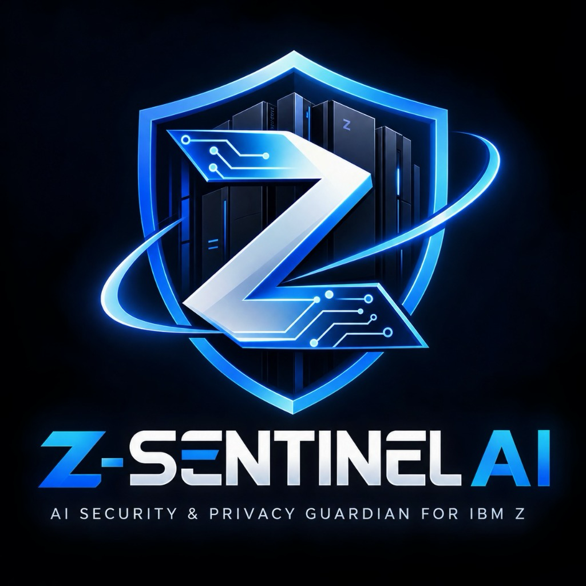

# Z-Sentinel AI
### AI Security & Privacy Guardian for IBM Z
**Tagline:** *"Detect threats. Protect data. Decide safely."*  
**Event:** IBM Z Datathon 2026  
**Created by:** Soman Singhal  
**GitHub:** [https://github.com/somansinghal/ZSentinel-AI](https://github.com/somansinghal/ZSentinel-AI)  
**Live Demo:** [https://z-sentinel-ai.vercel.app/](https://z-sentinel-ai.vercel.app/)  
**Contact:** [somansinghal06@gmail.com](mailto:somansinghal06@gmail.com)  

---

<p align="center">
  
</p>

---

## Overview

**Z-Sentinel AI** is an enterprise-grade AI Security & Privacy Guardian designed for mission-critical **IBM Z mainframe** transactional workloads. 

Built for the **IBM Z Datathon 2026**, Z-Sentinel AI addresses the dual challenge of modern high-velocity financial infrastructures: detecting distributed threats with sub-millisecond anomaly scoring while enforcing zero data leakage of sensitive customer Personally Identifiable Information (PII) before any data is logged or passed to an AI reasoning layer.

> [!IMPORTANT]
> **Hackathon Prototype Notice:** Z-Sentinel AI is an educational prototype and demonstration platform developed for the IBM Z Datathon 2026. All telemetry, account records, transaction events, and IBM Z streams demonstrated within this system are 100% synthetic. This project is not certified banking software, has not undergone third-party security audits, and does not claim official endorsement or certification from IBM Corporation.

---

## Problem

Global financial institutions rely on IBM Z mainframes to process over 70% of the world's transactional value. However, modern security operations centers (SOCs) face three critical bottlenecks:

1. **Velocity vs. Latency:** Mainframe transaction streams process tens of thousands of transactions per second. Heavy external AI API calls introduce unacceptable network latency (1,000+ ms) that degrades throughput.
2. **Privacy & Compliance Exposure:** Passing unredacted financial payloads (Primary Account Numbers, SSNs, routing numbers) into cloud AI models violates GDPR, PCI-DSS, and national banking privacy regulations.
3. **Single Point of Failure (SPOF):** Cloud-only security reasoning creates vulnerability. If an external AI provider experiences an outage or rate limit, security pipelines freeze.

---

## Solution

Z-Sentinel AI introduces a **layered, decoupled cyber defense architecture**:

1. **On-Premise Stream Ingestion:** Ingests simulated high-velocity IBM Z telemetry (SMF records, CICS transaction logs).
2. **Deterministic Privacy Guardian:** Intercepts and masks sensitive PII (PAN, SSN, email, phone) on-premise *prior* to persistence or analysis.
3. **Hybrid AI Security Engine:**
   - **Tier 1 (Instant):** Deterministic heuristic policy engine evaluates velocity, geography, and device parameters in < 0.5 ms.
   - **Tier 2 (Machine Learning):** Unsupervised `IsolationForest` model evaluates statistical multidimensional anomalies in < 2 ms.
   - **Tier 3 (Local Reasoning):** Local deterministic explanation engine produces auditable deduction factors and risk scores (0–100).
   - **Tier 4 (Cloud Fallback - Optional):** Asynchronous Groq AI integration provides natural language summaries only when available, without blocking core defenses.

---

## Key Features

- **Isolated Judge Demo Mode:** 1-click evaluation environment requiring zero credentials, zero passwords, and zero personal data.
- **Real Google Authentication:** Production-ready Firebase Authentication supporting Google Sign-In for SOC analysts.
- **SOC 7-Metrics Live Dashboard:** Real-time visibility into total throughput, AI-analyzed transactions, threat count, critical alerts, average risk score, redacted PII volume, and stream latency.
- **One-Click Threat Scenarios:** Instant demonstration of 8 attack patterns (Velocity Burst, Unknown Device, Geo-Leaping, Account Takeover, PII Exposure, Mainframe Event).
- **Zero-Leakage Privacy Redactor:** Regex and pattern-based sanitization replacing real account numbers with `************3210`.
- **AI Security Copilot:** Interactive analyst assistant answering natural language questions regarding flagged transactions with zero raw PII exposure.
- **Simulated IBM Z Adapter:** Clear architectural decoupling demonstrating how real CICS/SMF mainframe feeds plug into the pipeline.
- **Immutable Audit Trail:** SHA-256 integrity-hashed event log tracking all SOC actions.
- **10-Page Legal & Compliance Suite:** Comprehensive policies covering privacy, terms, acceptable use, AI limitations, and accessibility.

---

## Architecture

```
                               ┌────────────────────────────────┐
                               │  IBM Z Mainframe Event Stream   │
                               │  (Simulated CICS / SMF Telemetry)│
                               └───────────────┬────────────────┘
                                               │
                                               ▼
                               ┌────────────────────────────────┐
                               │    IBM Z Ingestion Adapter     │
                               │   (Channel Buffer Ring Queue)   │
                               └───────────────┬────────────────┘
                                               │
                                               ▼
                               ┌────────────────────────────────┐
                               │    Privacy Guardian Engine     │
                               │  (On-Premise Regex PII Redactor)│
                               └───────────────┬────────────────┘
                                               │ [Sanitized Payloads]
                                               ▼
                        ┌──────────────────────────────────────────────┐
                        │          Hybrid Security Risk Engine         │
                        │                                              │
                        │  ┌────────────────────┐ ┌──────────────────┐ │
                        │  │ Deterministic Heur.│ │ Isolation Forest │ │
                        │  │ Rule Engine (<1ms) │ │ ML Model (<2ms)  │ │
                        │  └─────────┬──────────┘ └────────┬─────────┘ │
                        │            └──────────┬──────────┘           │
                        │                       ▼                      │
                        │             Composite Risk Score             │
                        │                   (0 - 100)                  │
                        └───────────────────────┬──────────────────────┘
                                                │
                                                ▼
                               ┌────────────────────────────────┐
                               │    Local Explanation Engine    │
                               │  (Deterministic Decision Tree) │
                               └───────────────┬────────────────┘
                                               │
                       ┌───────────────────────┴───────────────────────┐
                       ▼                                               ▼
        ┌─────────────────────────────┐                 ┌─────────────────────────────┐
        │  SOC Operations Dashboard   │                 │  Groq AI Explainer (Opt.)   │
        │  (HTML5/CSS3/Vanilla JS)    │                 │  (Server-Side Resilient LLM)│
        └─────────────────────────────┘                 └─────────────────────────────┘
```

Component Status:
- **REAL:** Rule engine, Isolation Forest ML model, Privacy redactor, Local explanation engine, Firebase Auth, Frontend SOC console, Audit logging.
- **SIMULATED:** IBM Z mainframe event stream (synthetic transactions mimicking CICS/SMF data).
- **OPTIONAL:** Groq Cloud AI natural language summarizer (fails gracefully to local engine).

---

## Technology Stack

- **Frontend:** HTML5, CSS3, Vanilla JavaScript (ES6 Modules), Lucide Icons, Chart.js.
  - *No heavy frameworks:* Zero React, Vue, Next.js, or Angular. Zero client build step.
- **Backend:** Python 3.10+, FastAPI, Pydantic, Uvicorn.
- **AI / Machine Learning:** Scikit-Learn (`IsolationForest`), NumPy, Pandas.
- **Authentication:** Firebase Authentication (Google Sign-In) + Isolated Judge Demo Mode.
- **Deployment:** Vercel Serverless (`vercel.json` + `api/index.py`) & Free-First Architecture.
- **Testing:** Playwright End-to-End Suite (14 automated specs).

---

## AI/ML Architecture

Detailed documentation: [docs/ai-architecture.md](file:///Users/somansinghal/Downloads/ZSentinel%20AI/docs/ai-architecture.md)

1. **Feature Extraction:** Transactions are mapped to numerical vectors including amount deviation, frequency velocity, timestamp delta, and device novelty.
2. **Isolation Forest Model:** Unsupervised algorithm trained on normal baseline transactional telemetry. Points requiring fewer recursive partitions are classified as anomalies.
3. **Composite Scoring:** Combines ML anomaly probability with rule-based penalty factors:
   $$\text{Final Score} = \min(100, \, \text{ML\_Risk} + \sum \text{Rule\_Penalties})$$
4. **Deterministic Explainability:** The system produces human-readable deduction points without relying on a black-box LLM.

---

## Privacy Architecture

Detailed documentation: [docs/privacy-architecture.md](file:///Users/somansinghal/Downloads/ZSentinel%20AI/docs/privacy-architecture.md)

Z-Sentinel AI enforces **Zero Data Leakage**:
- **Primary Account Numbers (PAN):** Redacted to `************3210` using Luhn-aware patterns.
- **Social Security / Tax IDs:** Redacted to `*****4321`.
- **Email Addresses:** Masked to `u***r@domain.com`.
- **Phone Numbers:** Obfuscated to `+1 (555) ***-6543`.
- **Pre-Ingestion Redaction:** PII masking executes *before* data reaches the ML model, database, or external AI services.

---

## IBM Z Integration

Detailed documentation: [docs/ibm-z-integration.md](file:///Users/somansinghal/Downloads/ZSentinel%20AI/docs/ibm-z-integration.md)

- **Current Prototype:** High-throughput synthetic stream modeled after real IBM Z SMF Type 30/110 records and CICS transactions.
- **Adapter Interface:** The decoupled adapter layer defines standardized contracts (`IBMZEvent`, `IBMZChannelStatus`) ready to ingest data from IBM z/OS, IBM LinuxONE, or IBM Z Open Automation Utilities.
- **Transparent Attribution:** All mainframe streams are watermarked as `DEMO / SIMULATED IBM Z EVENT STREAM`.

---

## Judge Demo Mode

Z-Sentinel AI features a dedicated, frictionless **Judge Demo Mode**:
- **Zero Credentials:** Evaluators click **"Enter Judge Demo"** on the login page without providing an email, Google account, or password.
- **Deterministic Data:** Pre-populated with synthetic users (`DEMO-USER-001`), transactions (`TX-DEMO-001`), and threats (`THREAT-DEMO-001`).
- **Persistent Banner:** A prominent amber header confirms synthetic demo isolation.
- **One-Click Scenarios:** Evaluators can trigger 8 real-time threat scenarios and launch the interactive 8-step **Guided Tour**.
- **Exit Demo:** Clean teardown returning to the login portal with a single click.

---

## Google Authentication

In addition to Judge Demo mode, real Google Authentication is fully integrated via **Firebase Authentication**:
- **SSO Flow:** Evaluators with a Google Account can authenticate via Google Popup SSO.
- **User Profile:** Displays profile photo, display name, and role.
- **Session Security:** Managed securely via Firebase client SDK; real accounts are strictly isolated from synthetic demo sessions.

---

## Groq AI

- **Server-Side Security:** The Groq API key is strictly maintained on the server; it is never transmitted to client browsers.
- **Optional Enhancement:** Groq translates deterministic risk factors into conversational executive summaries.
- **Graceful Degradation:** If `GROQ_API_KEY` is not configured, the local rule engine handles 100% of queries seamlessly.

---

## Local Development

Detailed guide: [docs/local-development.md](file:///Users/somansinghal/Downloads/ZSentinel%20AI/docs/local-development.md)

### 1. Clone & Set Up
```bash
git clone https://github.com/somansinghal/ZSentinel-AI.git
cd ZSentinel-AI
```

### 2. Run Static Frontend
```bash
# Serve public/ directly with Python
python3 -m http.server 3000 --directory public
```
Visit: `http://localhost:3000/index.html`

### 3. Run FastAPI Backend
```bash
cd backend
python3 -m venv venv
source venv/bin/activate
pip install -r requirements.txt
cp .env.example .env
python3 main.py
```
API runs on: `http://localhost:8000` (OpenAPI docs: `http://localhost:8000/api/docs`)

---

## Environment Variables

Detailed guide: [docs/environment-variables.md](file:///Users/somansinghal/Downloads/ZSentinel%20AI/docs/environment-variables.md)

| Variable | Environment | Scope | Description |
|---|---|---|---|
| `GROQ_API_KEY` | Backend | Private | Optional Groq API key for natural language explanation |
| `GROQ_MODEL` | Backend | Private | Model identifier (Default: `llama-3.3-70b-versatile`) |
| `PORT` | Backend | Public | Server port (Default: `8000`) |
| `HOST` | Backend | Public | Server host bind (Default: `0.0.0.0`) |
| `FIREBASE_PROJECT_ID` | Frontend | Public | Firebase project identifier |
| `FIREBASE_API_KEY` | Frontend | Public | Firebase Web client API key |

---

## Vercel Deployment

Detailed guide: [docs/vercel-deployment.md](file:///Users/somansinghal/Downloads/ZSentinel%20AI/docs/vercel-deployment.md)

Z-Sentinel AI is structured for zero-configuration deployment to Vercel:
- `public/` serves as the static web root.
- `api/index.py` routes serverless API requests to the FastAPI backend.
- `vercel.json` provides routing rewrites between static pages and the Python API.

To deploy via Vercel CLI:
```bash
vercel --prod
```

---

## Playwright Testing

Detailed guide: [docs/playwright-testing.md](file:///Users/somansinghal/Downloads/ZSentinel%20AI/docs/playwright-testing.md)

The automated Playwright suite includes 14 end-to-end specifications:

```bash
# Run all tests
npm test

# Run individual suites
npm run test:demo      # Judge Demo complete lifecycle
npm run test:legal     # All 10 legal pages verification
npm run test:seo       # SEO, Open Graph, JSON-LD, robots.txt, sitemap.xml
```

| Test Spec | Target |
|---|---|
| `01-landing.spec.js` | Landing page hero, branding, telemetry ribbon |
| `02-login.spec.js` | Login dual-panel authentication layout |
| `03-demo-login.spec.js` | Judge Demo complete 10-step lifecycle journey |
| `04-dashboard.spec.js` | SOC 7-metrics grid, Chart.js, scenario chips |
| `05-transactions.spec.js` | Mainframe transaction stream & simulator controls |
| `06-threats.spec.js` | Threat detection center & severity badges |
| `07-privacy.spec.js` | Privacy Guardian zero data leakage masking |
| `08-alerts.spec.js` | Incident triage queue & priority assignments |
| `09-copilot.spec.js` | AI Copilot conversational reasoning interface |
| `10-ibmz.spec.js` | Mainframe adapter telemetry & health tiles |
| `11-responsive.spec.js` | Responsive mobile drawer & viewport adaptation |
| `12-api-health.spec.js` | REST API health, analysis, and privacy endpoints |
| `13-legal-pages.spec.js` | Verification of all 10 legal and compliance pages |
| `14-seo.spec.js` | SEO tags, Open Graph, Twitter cards, JSON-LD schema |

---

## Screenshots

Detailed guide: [artifacts/screenshots/README.md](file:///Users/somansinghal/Downloads/ZSentinel%20AI/artifacts/screenshots/README.md)

Automated screenshot generator captures 15 pages in both **Desktop (1440×900)** and **Mobile (390×844)** viewports:
```bash
npm run screenshots
```
Outputs are saved directly to `artifacts/screenshots/`.

---

## Demo Video

Detailed guide: [artifacts/videos/README.md](file:///Users/somansinghal/Downloads/ZSentinel%20AI/artifacts/videos/README.md)

Automated video generator records a smooth 1280×720 (16:9) walkthrough of the complete Judge Demo experience:
```bash
npm run record:video
```
Outputs are saved directly to `artifacts/videos/`. Zero credentials or private keys are ever exposed.

---

## Documentation

A complete 18-part documentation package is available in the [`docs/`](file:///Users/somansinghal/Downloads/ZSentinel%20AI/docs/) directory:

1. [Architecture Overview](file:///Users/somansinghal/Downloads/ZSentinel%20AI/docs/architecture.md)
2. [REST API Documentation](file:///Users/somansinghal/Downloads/ZSentinel%20AI/docs/api.md)
3. [AI & ML Architecture](file:///Users/somansinghal/Downloads/ZSentinel%20AI/docs/ai-architecture.md)
4. [Security Architecture](file:///Users/somansinghal/Downloads/ZSentinel%20AI/docs/security-architecture.md)
5. [Privacy Architecture](file:///Users/somansinghal/Downloads/ZSentinel%20AI/docs/privacy-architecture.md)
6. [IBM Z Integration](file:///Users/somansinghal/Downloads/ZSentinel%20AI/docs/ibm-z-integration.md)
7. [Firebase Setup Guide](file:///Users/somansinghal/Downloads/ZSentinel%20AI/docs/firebase-setup.md)
8. [Groq AI Setup Guide](file:///Users/somansinghal/Downloads/ZSentinel%20AI/docs/groq-setup.md)
9. [Vercel Deployment Guide](file:///Users/somansinghal/Downloads/ZSentinel%20AI/docs/vercel-deployment.md)
10. [Local Development](file:///Users/somansinghal/Downloads/ZSentinel%20AI/docs/local-development.md)
11. [Playwright Testing](file:///Users/somansinghal/Downloads/ZSentinel%20AI/docs/playwright-testing.md)
12. [Judge Quick Start Guide](file:///Users/somansinghal/Downloads/ZSentinel%20AI/docs/judge-guide.md)
13. [Demo Presentation Script](file:///Users/somansinghal/Downloads/ZSentinel%20AI/docs/demo-script.md)
14. [Troubleshooting Guide](file:///Users/somansinghal/Downloads/ZSentinel%20AI/docs/troubleshooting.md)
15. [Environment Variables](file:///Users/somansinghal/Downloads/ZSentinel%20AI/docs/environment-variables.md)
16. [Threat Model](file:///Users/somansinghal/Downloads/ZSentinel%20AI/docs/threat-model.md)
17. [Data Flow](file:///Users/somansinghal/Downloads/ZSentinel%20AI/docs/data-flow.md)
18. [Submission Checklist](file:///Users/somansinghal/Downloads/ZSentinel%20AI/docs/submission-checklist.md)

---

## Security

Detailed security policy: [SECURITY.md](file:///Users/somansinghal/Downloads/ZSentinel%20AI/SECURITY.md)  
Detailed threat model: [docs/threat-model.md](file:///Users/somansinghal/Downloads/ZSentinel%20AI/docs/threat-model.md)

- **Defense in Depth:** Combined heuristic rules, unsupervised ML, and deterministic boundary checks.
- **Zero Secrets on Client:** No API keys, credentials, or private certificates exist in browser code.
- **Fail-Safe Operation:** AI reasoning defaults to deterministic local logic if external APIs fail.
- **Isolated Demo:** Demo mode operates in a read-only simulated state with zero access to real user documents.

---

## Legal

Z-Sentinel AI includes a complete 10-page legal and compliance suite in [`public/legal/`](file:///Users/somansinghal/Downloads/ZSentinel%20AI/public/legal/):

1. [Privacy Policy](file:///Users/somansinghal/Downloads/ZSentinel%20AI/public/legal/privacy-policy.html)
2. [Terms of Service](file:///Users/somansinghal/Downloads/ZSentinel%20AI/public/legal/terms-of-service.html)
3. [Cookie Policy](file:///Users/somansinghal/Downloads/ZSentinel%20AI/public/legal/cookie-policy.html)
4. [Acceptable Use Policy](file:///Users/somansinghal/Downloads/ZSentinel%20AI/public/legal/acceptable-use.html)
5. [Security Architecture & Principles](file:///Users/somansinghal/Downloads/ZSentinel%20AI/public/legal/security.html)
6. [AI Disclaimer & Explainability](file:///Users/somansinghal/Downloads/ZSentinel%20AI/public/legal/ai-disclaimer.html)
7. [Data Processing Agreement](file:///Users/somansinghal/Downloads/ZSentinel%20AI/public/legal/data-processing.html)
8. [Third-Party Services Directory](file:///Users/somansinghal/Downloads/ZSentinel%20AI/public/legal/third-party-services.html)
9. [Accessibility Statement](file:///Users/somansinghal/Downloads/ZSentinel%20AI/public/legal/accessibility.html)
10. [Contact Information](file:///Users/somansinghal/Downloads/ZSentinel%20AI/public/legal/contact.html)

---

## Limitations

- **Simulated Mainframe Data:** Telemetry is generated deterministically; it is not connected to a live production IBM z16 mainframe.
- **Educational Prototype:** This system has not undergone third-party penetration testing or formal compliance certification (SOC 2, ISO 27001).
- **Advisory AI Output:** AI Copilot outputs are informational and designed to assist human security analysts, not replace human judgment.

---

## Future Improvements

- Direct bi-directional integration with IBM Z Open Automation Utilities (ZOAU) and z/OS Management Facility (z/OSMF).
- Integration of hardware-accelerated on-chip AI inference via the IBM Telum processor.
- Quantum-safe encryption support using CRYSTALS-Kyber / Dilithium algorithm adapters.
- Multi-tenant enterprise role-based access control (RBAC) with hardware security module (HSM) key management.

---

## Datathon

- **Event:** IBM Z Datathon 2026
- **Track:** AI & Cybersecurity for Enterprise Mainframes
- **Submission Date:** September 2026
- **Status:** Complete Free-First Architecture • Demo Ready • Judge Friendly

---

## Author

**Soman Singhal**  
- **Role:** Project Creator & Architect (IBM Z Datathon 2026)  
- **GitHub:** [https://github.com/somansinghal](https://github.com/somansinghal)  
- **Repository:** [https://github.com/somansinghal/ZSentinel-AI](https://github.com/somansinghal/ZSentinel-AI)  
- **Email:** [somansinghal06@gmail.com](mailto:somansinghal06@gmail.com)  

---

## Contact

For inquiries regarding Z-Sentinel AI, architecture reviews, demonstrations, or responsible vulnerability reporting:
- **Email:** [somansinghal06@gmail.com](mailto:somansinghal06@gmail.com)
- **GitHub Repository:** [https://github.com/somansinghal/ZSentinel-AI](https://github.com/somansinghal/ZSentinel-AI)
- **Live Deployment:** [https://z-sentinel-ai.vercel.app/](https://z-sentinel-ai.vercel.app/)
- **Contact Page:** [public/legal/contact.html](file:///Users/somansinghal/Downloads/ZSentinel%20AI/public/legal/contact.html)

---

## License

This project is licensed under the MIT License - see the [LICENSE](file:///Users/somansinghal/Downloads/ZSentinel%20AI/LICENSE) file for details. Third-party dependencies remain subject to their respective licenses.

